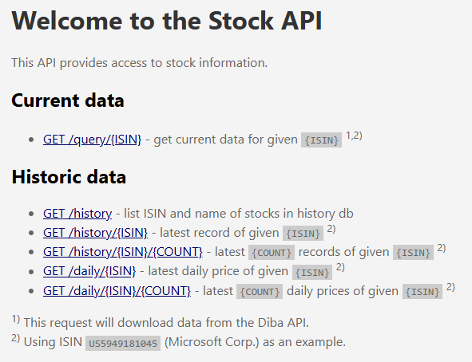

# Stock API

[](https://github.com/ramdacxp/stock-api/actions/workflows/publish.yml)

PHP REST API to track stock portfolio.  
<http://stock-api.schademarmelade.de/>



_(Updated during [Session #55 👨‍💻 April 2025](https://session.pestilenz.org/))_

## Development

This repo is using PHP and Composer from <https://github.com/ramdacxp/php-devenv>, which needs to be cloned into a _parallel_ folder `php-devenv`.

A Maria DB plus webserver hosting [PHPMyAdmin](http://127.0.0.1:8181) can be started via:

```cmd
database
```

In a development shell `composer` can be used to install required PHP packages and to start a development webserver, which then serves the project at locally at <http://localhost:8080/>:

```cmd
devenv
composer install
composer start
```

## Project Features

* GitHub Publish Workflow
* SQL sample files
* PHP Micro Framework Slim with DI and App Factory
* Configuration for Production & Development
* REST API with class based route handlers
* Static file handler (can be mixed with REST API)
* Report exceptions as JSON

## Links

* [ramdacxp/php-devenv](https://github.com/ramdacxp/php-devenv) - Repo which is providing PHP development tools like PHP, Composer, MariaDB

* [Slim](https://www.slimframework.com/) - PHP Micro Framework
  * [slimphp/Slim-Skeleton](https://github.com/slimphp/Slim-Skeleton) - Slim v4 App Skeleton
  * [PHP-DI](https://php-di.org/doc/frameworks/slim.html)

* [Awesome PSR-15 Middlewares](https://github.com/middlewares/awesome-psr15-middlewares?tab=readme-ov-file)

* ING Diba stock data REST API, e.g. for [Microsoft](https://component-api.wertpapiere.ing.de/api/v1/components/instrumentheader/US5949181045), will provide the following JSON data:

  ```json
  {
    "id": 951692,
    "name": "Microsoft",
    "price": 332.5,
    "close": 321.3,
    "bid": 332.45,
    "bidDate": "2025-04-23T19:07:05+02:00",
    "ask": 332.65,
    "askDate": "2025-04-23T19:07:05+02:00",
    "changePercent": 3.48583877995643,
    "changeAbsolute": 11.2,
    "instrumentTypeDisplayName": "Aktie",
    "wkn": "870747",
    "isin": "US5949181045",
    "internalIsin": "US5949181045",
    "stockMarket": "Direkthandel",
    "priceChangeDate": "2025-04-23T19:05:25+02:00",
    "currency": "EUR",
    "currencySign": "EUR",
    "pushSymbol": "X000ADB0200951692"
  }
  ```
